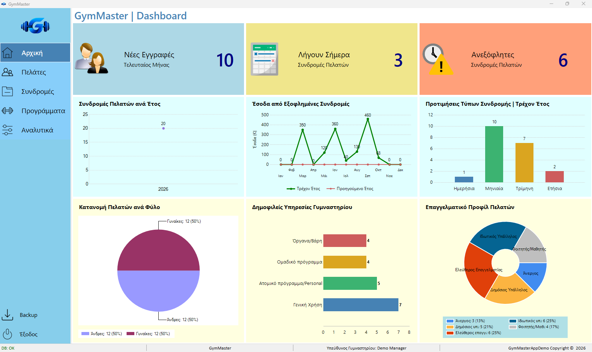
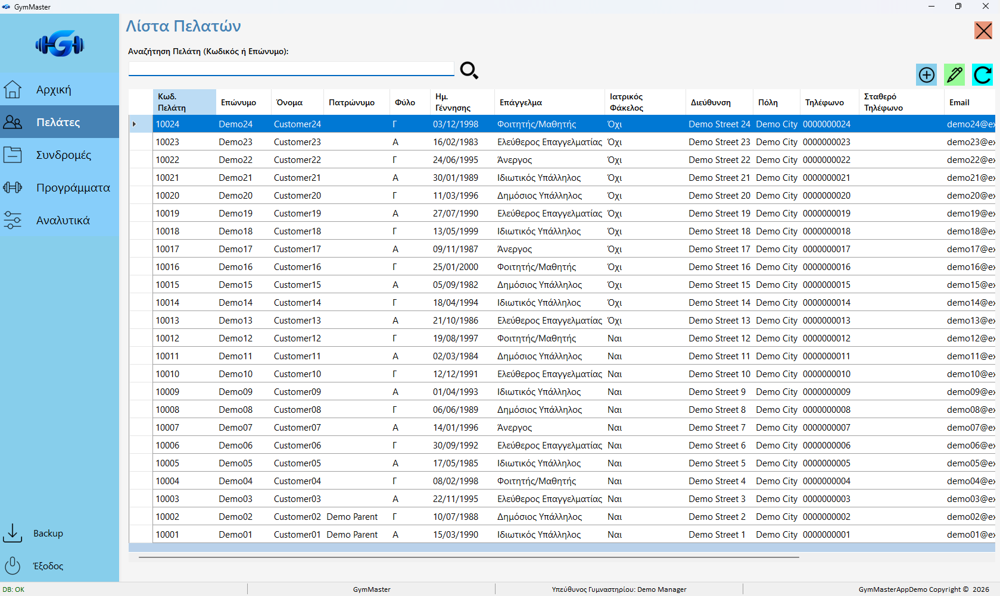
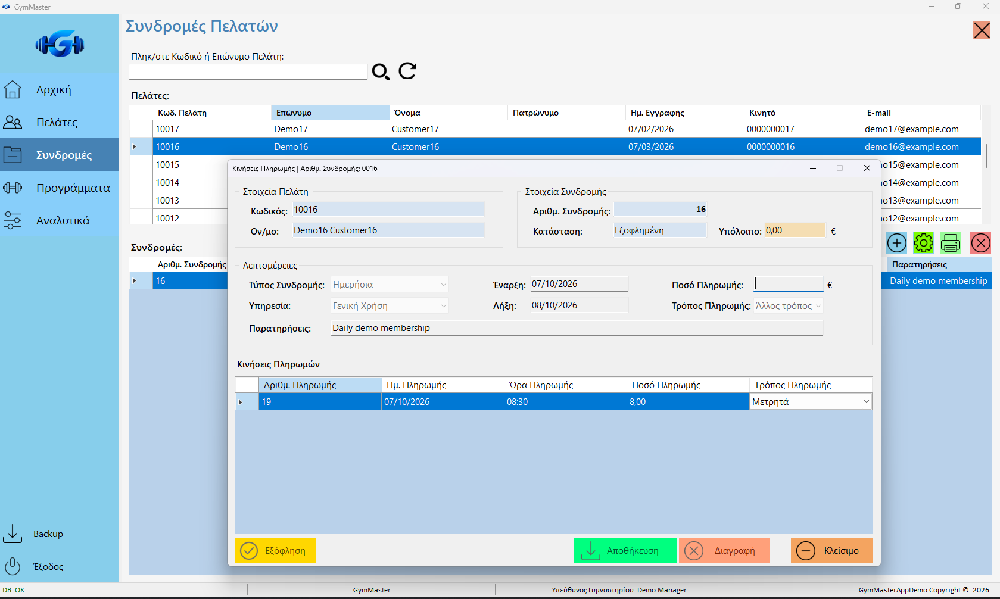
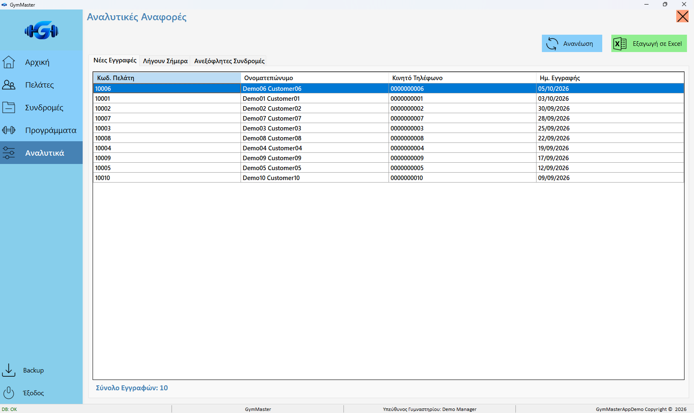
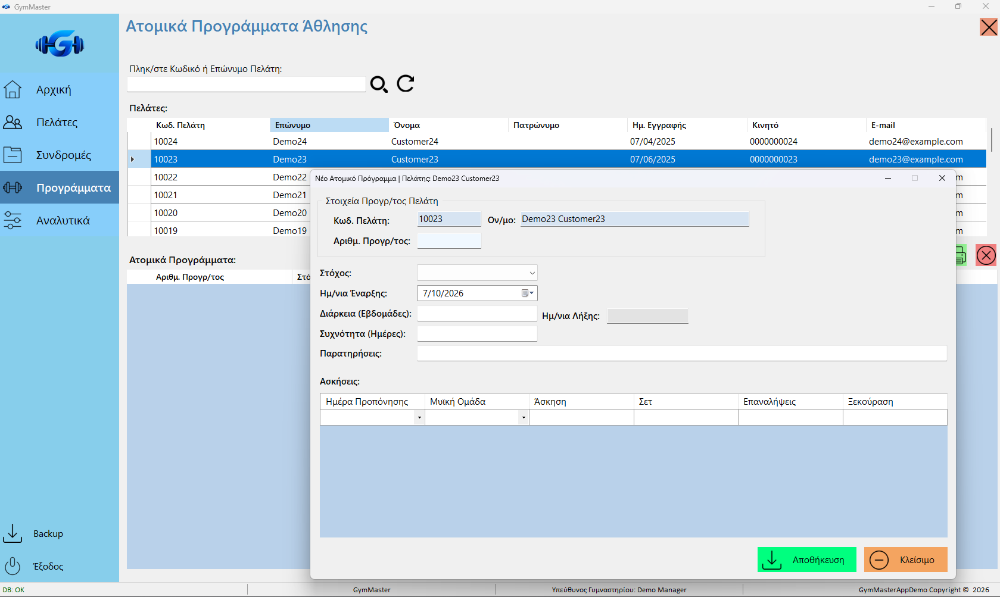

# GymMasterAppDemo

Desktop Gym Management Application built with C#, Windows Forms, SQL Server and the MVP architectural pattern.

## Overview

GymMasterAppDemo is a Windows desktop portfolio application for managing customers, gym memberships, payments and individual workout programs. It includes a dashboard, reports and printing tools, backed by a dedicated SQL Server demo database.

The interface is primarily in Greek. The supplied database scripts reproduce the application schema, reference catalogs and synthetic demonstration records.

## Features

- Customer management and search.
- Health records and emergency-contact information.
- Membership management, dates, status and pricing.
- Payment tracking and payment history.
- Dashboard charts and summary indicators.
- Analytics for recent customers, memberships expiring today and unpaid memberships.
- Individual workout programs, goals and exercise details.
- Membership and workout-program printing / print preview.
- Excel export of analytics reports through ClosedXML.
- Backup of the demo database only.

## Architecture

The application follows the Model–View–Presenter (MVP) pattern:

- **Models** represent customer, health, membership, payment and workout data.
- **Views** define interfaces implemented by Windows Forms.
- **Presenters** coordinate view events and application operations.
- **Data** contains ADO.NET repositories, database configuration and the demo connection guard.
- **Services** provides database backup functionality.
- **Printing** builds printable membership and workout documents.

Some dashboard queries live directly in the dashboard form. This is a single-project desktop solution, with SQL deployment scripts maintained separately.

## Technologies

- C# and Windows Forms.
- .NET Framework 4.8.
- SQL Server Express and Windows Authentication.
- ADO.NET / `System.Data.SqlClient`.
- ClosedXML and Open XML dependencies for Excel export.
- Windows Forms DataVisualization charts.
- NuGet dependencies managed through `packages.config`.

## Database

The application uses **GymMasterDBDemo**. The schema contains 13 tables covering customers, health records, memberships, payments, workout programs and reference catalogs.

The deployment scripts are in `database/` and must be executed in this order:

1. `01_CreateDatabase.sql`
2. `02_CreateSchema.sql`
3. `03_SeedReferenceData.sql`
4. `04_SeedDemoData.sql`

The database creation script leaves an existing database unchanged. The schema script expects the application tables to be absent and stops if they already exist. The reference seed preserves existing keys. The demo seed **replaces transactional data in GymMasterDBDemo** and checks the active database name before making changes. Use a dedicated demo database.

SQL Server generates identity IDs; the seed preserves relationships through ID maps. Dates for memberships, payments, recent registrations and workout programs are relative to execution day so that the dashboard and reports remain useful over time. Birth dates remain fixed synthetic values.

## Demo Data

| Table | Records |
|---|---:|
| Customers | 25 |
| HealthRecord | 12 |
| Membership | 20 |
| Payments | 23 |
| ProgramsWorkout | 8 |
| ProgramsWorkoutDetails | 23 |

Customer IDs range from **10001 to 10025**. One customer is inactive, so the existing active-customer lists display 24 customers.

Reference data includes 5 occupations, 4 services, 4 membership types, 4 payment methods, 3 membership statuses, 5 workout goals and the complete catalog of **69 exercises**. Membership codes `ΗΜ01`, `ΜΗ01`, `ΜΗ03` and `ΜΗ12` use Greek characters.

All customer-related records are synthetic/demo data.

## Installation / Setup

### Prerequisites

- Windows.
- Visual Studio 2022 with the **.NET desktop development** workload and the **.NET Framework 4.8 targeting pack**.
- SQL Server Express; the default instance is `.\SQLEXPRESS`.
- Windows Authentication and permission to create the demo database and its tables.
- SQL Server Management Studio or another SQL client that supports `GO` batch separators.
- Access to NuGet for restoring the pinned package versions.

### Database setup

Connect to `.\SQLEXPRESS` with Windows Authentication and execute the four scripts in the order listed above. Keep the SQL files in their original Unicode encoding.

### Solution setup

1. Open `GymMasterAppDemo.sln` in Visual Studio.
2. Restore NuGet packages using **Restore NuGet Packages** on the solution.
3. Set `GymMasterAppDemo` as the startup project.
4. Select **Debug / Any CPU**, then **Rebuild Solution**.

The local `packages/` folder is excluded from source control. `packages.config` and the project references are included, so the exact dependency versions can be restored. No package version changes are required.

### Configuration

`GymMasterAppDemo/App.config` defines `GymMasterDbConnection` with this default connection string:

```text
Data Source=.\SQLEXPRESS;Initial Catalog=GymMasterDBDemo;Integrated Security=True;TrustServerCertificate=True
```

If using a different SQL Server instance, update `Data Source` in `App.config`. Keep `Initial Catalog=GymMasterDBDemo` and use Windows Authentication.

The demo safety guard permits connections only to a database named **GymMasterDBDemo**. It checks both the configured catalog and the active connection database. There is no alternate database fallback.

## Running the Application

Start the application with **F5** or **Ctrl+F5** in Visual Studio after database setup and package restore. The main window opens the dashboard and displays a database connection indicator.

Use the navigation menu to view customers, memberships, analytics and workout programs. Reports and charts depend on the seeded dates; rerun the demo seed when you want to refresh the demonstration scenarios.

The database backup command targets only GymMasterDBDemo and writes to `C:\GymMasterAppDemo_Backups`. SQL Server's service account must have write access to that folder, and the Windows login needs permission to back up the database. The path is local to the SQL Server machine.

## Project Structure

```text
GymMasterAppDemo/
├── GymMasterAppDemo.sln
├── GymMasterAppDemo/
│   ├── Data/
│   ├── Forms/
│   ├── Models/
│   ├── Presenters/
│   ├── Printing/
│   ├── Properties/
│   ├── Resources/
│   ├── Services/
│   ├── Views/
│   ├── App.config
│   ├── GymMasterAppDemo.csproj
│   └── packages.config
├── database/
│   ├── 01_CreateDatabase.sql
│   ├── 02_CreateSchema.sql
│   ├── 03_SeedReferenceData.sql
│   └── 04_SeedDemoData.sql
├── screenshots/
├── .gitignore
└── README.md
```

## Screenshots

The following screenshots show the running application with synthetic demo data.

### Dashboard

Summary indicators and charts for memberships, revenue and customer demographics.



### Customer Management

Searchable customer records with synthetic contact and profile information.



### Memberships & Payments

Membership details, payment history and outstanding balances.



### Analytics

Reports for recent registrations, expiring memberships and unpaid memberships.



### Workout Programs

Workout-program setup with goals, dates, frequency and exercise details.



## Privacy & Demo Disclaimer

This repository is a portfolio/demo edition. All customer, health, membership, payment and workout-program records included in the demo database are synthetic and do not represent real individuals.

The demo is intended for showcasing the application. Keep it connected to the dedicated synthetic database. Local IDE metadata, build outputs, restored packages, logs and SQL Server binary data/backup files are excluded from source control.
